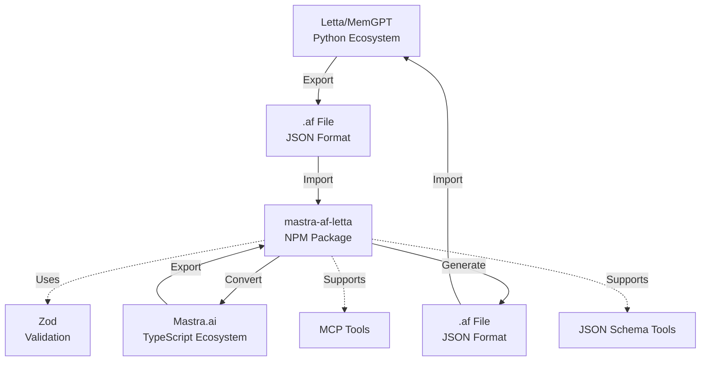
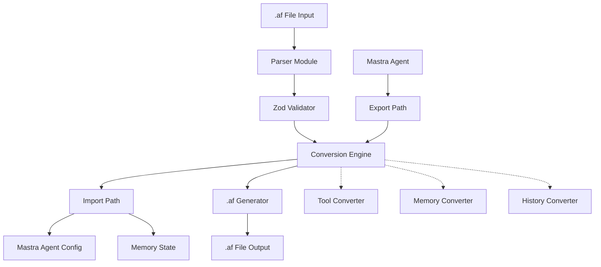
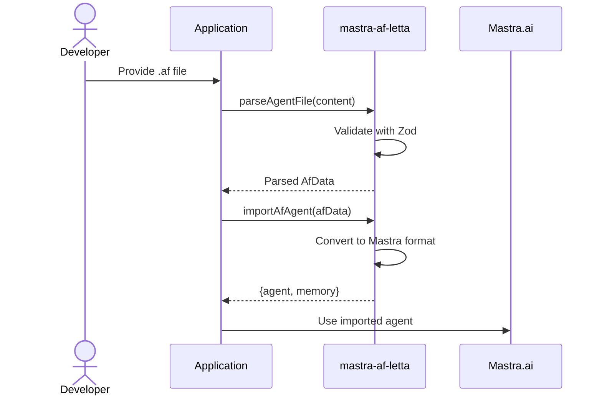
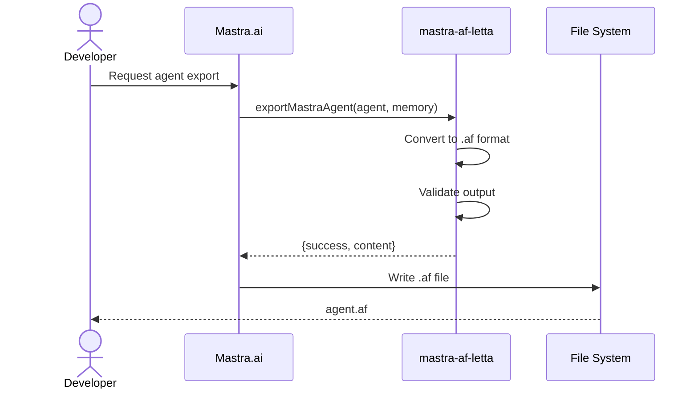
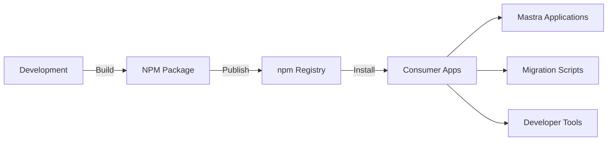

# System Overview - mastra-af-letta

## Purpose
This document provides a high-level overview of the mastra-af-letta npm package, its purpose, key components, and how it enables agent portability between AI frameworks.

## Classification
- **Domain:** Foundation
- **Stability:** Semi-stable
- **Abstraction:** Conceptual
- **Confidence:** Established

## Content

### System Purpose and Vision

The mastra-af-letta package solves the critical problem of AI agent portability between different frameworks. It enables developers to:
- Migrate agents between Letta (Python) and Mastra.ai (TypeScript) ecosystems
- Version control agent definitions in a git-friendly JSON format
- Share and distribute pre-configured agents across teams
- Preserve agent state, tools, and conversation history during transfers

The package targets AI developers who work with multiple agent frameworks and need seamless interoperability without data loss or manual translation.

### System Context

### Key Capabilities

1. **Agent Import**
   - Parse and validate .af JSON files
   - Convert Letta agent configurations to Mastra format
   - Preserve memory blocks (core_memory, recall_memory)
   - Maintain conversation history with tool calls

2. **Agent Export**
   - Convert Mastra agents back to .af format
   - Generate valid JSON for Letta compatibility
   - Preserve all agent state and configuration
   - Support for custom metadata

3. **Tool Conversion**
   - JSON Schema tool definitions
   - MCP (Model Context Protocol) tools
   - Python and JavaScript source code preservation
   - Authentication reference handling (non-embedded)

4. **Validation & Auto-Fix**
   - Comprehensive Zod schema validation
   - Auto-fix common .af format issues
   - Detailed error reporting
   - Type-safe operations

### High-Level Architecture

#### Key Components

1. **Parser Module** (`src/parser.ts`)
   - Reads and parses .af JSON files
   - Handles malformed JSON gracefully
   - Provides initial structure validation

2. **Validation Layer** (`src/schemas/`)
   - Zod schemas for all data structures
   - Runtime type checking
   - Comprehensive error messages

3. **Conversion Engine** (`src/converters/`)
   - Core logic for bidirectional conversion
   - Handles format differences between platforms
   - Preserves semantic meaning across translations

4. **Type System** (`src/types/`)
   - TypeScript interfaces for all entities
   - Ensures compile-time type safety
   - Exports types for consumer applications

### Key Workflows

#### Import Workflow

#### Export Workflow

### Technology Stack

| Layer | Technologies | Justification |
|-------|--------------|---------------|
| Core Language | TypeScript 5.x | Type safety, modern JS features |
| Validation | Zod | Runtime validation with TypeScript inference |
| Build System | tsup | Fast, zero-config bundler |
| Testing | Vitest | Fast, TypeScript-native testing |
| Package Management | npm/pnpm | Standard Node.js ecosystem |
| Target Runtime | Node.js 18+ | LTS support, modern features |

### Deployment Model

### Quality Attributes

#### Performance
- Efficient JSON parsing for large conversation histories
- Minimal dependencies for fast installation
- Streaming support for large .af files (future)

#### Reliability
- Comprehensive test coverage
- Graceful error handling
- No data loss guarantees

#### Security
- No credential storage in .af files
- Authentication via reference only
- Input validation against malicious payloads

#### Maintainability
- Clear module boundaries
- Extensive TypeScript types
- Comprehensive documentation

#### Compatibility
- Adherence to .af specification
- Backward compatibility policy
- Version detection and migration

### Future Evolution

1. **CLI Tool** - Command-line interface for easy conversion
2. **Web Interface** - Browser-based converter
3. **Streaming API** - Handle very large agent files
4. **Platform Extensions** - Support for additional AI frameworks
5. **Schema Evolution** - Automatic migration between .af versions

## Relationships
- **Parent Nodes:** [foundation/project_definition.md]
- **Child Nodes:** 
  - [architecture/component_map.md] - details - Component relationships
  - [architecture/conversion_architecture.md] - details - Conversion system design
- **Related Nodes:** 
  - [specs/af_format_specification.md] - implements - .af format details
  - [cross_cutting/typescript_configuration.md] - uses - TypeScript setup

## Navigation Guidance
- **Access Context:** Start here for understanding the package's purpose and architecture
- **Common Next Steps:** Explore component details or .af format specification
- **Related Tasks:** Package setup, integration planning, format understanding
- **Update Patterns:** Update when major architectural changes occur

## Metadata
- **Created:** 2025-07-13
- **Last Updated:** 2025-07-13
- **Updated By:** AI Assistant

## Change History
- 2025-07-13: Initial creation of system overview for mastra-af-letta